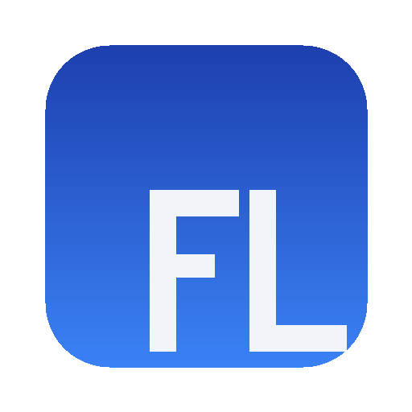

<p align="center">
  
</p>

<h1 align="center">FocusLedger</h1>

<p align="center">
  <strong>See exactly where your time goes.</strong>
</p>

<p align="center">
  <a href="https://github.com/MuditNautiyal-21/FocusLedger/releases/latest">
    
  </a>
  
  
  
</p>

<br />

FocusLedger is a desktop app that silently tracks which applications and browser tabs you use throughout the day, classifies each one as productive or not, and turns that raw data into clean Excel reports you can hand to your manager or keep for yourself.

It runs locally. No cloud. No accounts. Your data never leaves your machine.

<br />

## How It Works

1. **Tracks** the active window every second using OS-level APIs
2. **Asks** you to classify new apps the first time they appear (productive, neutral, or wasted)
3. **Remembers** your choices and auto-classifies from then on
4. **Shows** a live dashboard with your productivity score, streaks, and top apps
5. **Exports** polished Excel reports with daily summaries, activity logs, analytics, and weekly trends

<br />

## Screenshots

| Dashboard | Timeline | Reports |
|:-:|:-:|:-:|
| Live productivity score, top apps, focus streaks | Chronological view of every app switch | Charts, heatmaps, and one-click Excel export |

<br />

## Download

Grab the latest installer from the [Releases](https://github.com/MuditNautiyal-21/FocusLedger/releases/latest) page:

| Platform | File | Notes |
|---|---|---|
| **Windows 10/11** | `FocusLedger Setup 1.0.0.exe` | Standard NSIS installer |
| **macOS (Apple Silicon)** | `FocusLedger-1.0.0-arm64.dmg` | M1, M2, M3, M4 Macs |
| **macOS (Intel)** | `FocusLedger-1.0.0.dmg` | 2020 and older Macs |

<br />

## Features

### Activity Tracking
- Detects the active window every second
- Extracts URLs and domains when a browser is focused
- Pauses automatically when you lock your screen or go idle
- Asks what you were doing when you come back from a break

### Smart Classification
- Pop-up prompt for new apps with one-click classification
- "Remember this" checkbox creates permanent rules
- Pre-loaded rules for 40+ common apps and websites
- Rule types: domain, app name, title keyword, regex, time-based

### Dashboard
- Real-time session timer with animated digit transitions
- Circular productivity gauge (color-coded: green/yellow/red)
- Focus streak tracker with best-of-day record
- Timeline bar showing productive/wasted blocks across the day
- Top apps ranked by time spent
- Live activity indicator showing what you are working on right now

### Excel Reports
- **Daily Summary**: hours per day, top productive app, top time waster, productivity score
- **Activity Log**: every app switch with timestamps, duration, classification
- **Analytics**: time breakdown, top 10 apps with data bars, hourly productivity heatmap
- **Weekly Trends**: day-by-day comparison, best/worst day highlighted
- Conditional formatting, frozen headers, auto-fitted columns, alternating row colors

### Rules Engine
- Create rules by domain, app name, keyword, regex, or time range
- Drag-and-drop priority ordering
- "Test Rule" tool to verify matches before saving
- Auto-suggestions based on frequently unclassified activities

### Browser Extension
- Companion extension for Chrome and Edge
- Sends the exact URL and page title to FocusLedger via Native Messaging
- Shows a colored badge on the toolbar (green = productive, red = wasted)
- Falls back to window title parsing when the extension is not installed

<br />

## Tech Stack

| Layer | Technology |
|---|---|
| Framework | Electron 33 |
| Frontend | React 18, TypeScript (strict) |
| Bundler | Vite 5 |
| Styling | Tailwind CSS 3 |
| State | Zustand |
| Database | SQLite via better-sqlite3 |
| Charts | Recharts |
| Animations | Framer Motion |
| Icons | Lucide React |
| Excel | ExcelJS |
| Packaging | electron-builder |

<br />

## Development

### Prerequisites

- Node.js 20+
- Visual Studio Build Tools with "Desktop development with C++" (Windows only, for native modules)

### Setup

```bash
git clone https://github.com/MuditNautiyal-21/FocusLedger.git
cd FocusLedger
npm install
```

### Run in development

```bash
npm run dev
```

This compiles the main process, starts the Vite dev server for the renderer, and launches Electron. The renderer hot-reloads on save.

### Build for distribution

```bash
npm run build
npm run package
```

The installer appears in the `release/` directory.

### Project structure

```
focusledger/
  src/
    main/                  Electron main process
      index.ts             Entry point, window creation, lifecycle
      tray.ts              System tray icon and context menu
      menu.ts              Application menu bar
      logger.ts            File-based error logging
      preload.ts           Context bridge for IPC
      tracking/            Activity polling, session management, idle detection
      classification/      Prompt window, rules engine, default rules
      database/            SQLite connection, migrations, typed queries
      export/              Excel report builder with 4-sheet output
      ipc/                 All IPC handler registrations
    renderer/              React frontend
      components/
        layout/            Shell, Sidebar
        dashboard/         Timer, gauge, streak, timeline, top apps, live view
        timeline/          Activity blocks with expand/reclassify
        reports/           Charts, heatmap, usage table, export button
        rules/             Rule cards, add/edit modal, suggestions
        settings/          All config panels
        onboarding/        4-step first-launch wizard
        shared/            GlassCard, ErrorBoundary
      hooks/               useDashboard
      stores/              sessionStore, settingsStore (Zustand)
      styles/              Tailwind globals, CSS custom properties
    shared/                TypeScript types shared between processes
    extension/             Chrome/Edge companion extension (Manifest V3)
  scripts/                 Native messaging host installer
  resources/               App icons and NSIS installer script
```

<br />

## Browser Extension Setup

The extension ships bundled inside the app. After installing FocusLedger:

1. Open Chrome or Edge and go to `chrome://extensions`
2. Turn on **Developer mode** (toggle in the top right)
3. Click **Load unpacked**
4. Navigate to the FocusLedger install directory and select the `extension` folder
5. The FocusLedger badge appears in your toolbar

The native messaging host is registered automatically during installation.

<br />

## Configuration

All settings are stored locally in SQLite. Open **Settings** from the sidebar to configure:

- Polling interval (500ms to 3000ms)
- Idle detection threshold (1 to 30 minutes)
- Excluded apps
- Prompt style and auto-collapse timeout
- Default export folder
- Auto-export schedule
- Auto-launch on startup
- Minimize to tray behavior

<br />

## Privacy

FocusLedger is completely offline. It does not connect to any server, does not send telemetry, and does not require an account. All data is stored in a single SQLite file on your machine. You can delete it at any time from Settings > Data > Clear All History.

<br />

## License

MIT
